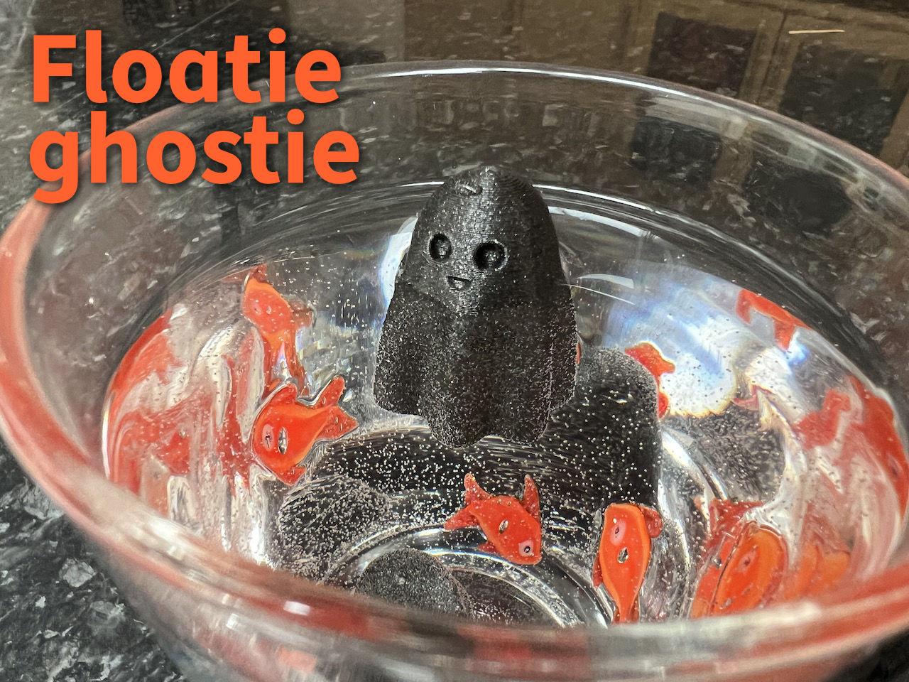

# Floatie Ghostie

## About

Floatie Ghostie is the hauntastic bath toy that'll spook up your little one's tub time!

These buoyant boos will float and flutter around the tub, providing endless entertainment for your little ghost hunters. With their cute and cuddly design, Floatie Ghostie will have your kids shrieking with delight as they splash and play with these friendly phantoms.

So if you're looking for a ghoul-tastic addition to your child's bath routine, look no further than Floatie Ghostie - a ghostly companion for some boo-rific bath time fun!

This is a remix of [FatherLicorice's](https://www.printables.com/@FatherLicorice) great [Ghosties!](https://www.printables.com/model/285801-ghosties).

<https://www.printables.com/model/453321-floatie-ghostie/files>

## How to print

To make this float just right, you have to ensure the bottom 14 mm of the ghostie has 100% infill.

If you import the `.3mf` file into PrusaSlicer, this should happen automatically.

Otherwise, in PrusaSlicer, import the `.stl` file then:

- Print Settings → Infill → Fill density: 100%.

- Plater → Right click on floatie-ghostie.stl → Height Range Modifier

- Plater → Height ranges → Start at height: 14

- Plater → Height ranges → Stop at height: 42

- Plater → Right click on Range 14.00-42.00 (mm) → Infill

- Plater → Fill density: 15%.

- Plater → Fill pattern: Cubic.

Enjoy!

## License

CC BY-SA 4.0

## Author

Leon Brocard <acme@astray.com>
